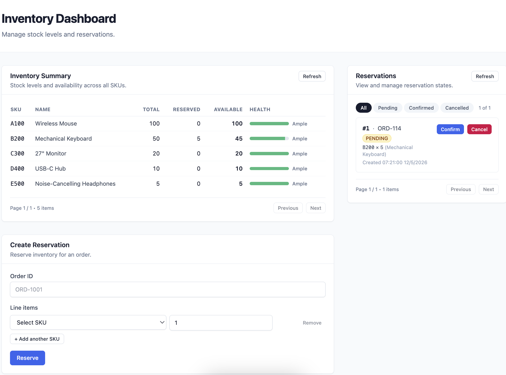

# Warehouse Inventory Reservation System

[](https://github.com/taidev198/reserve-fullstack/actions/workflows/backend-ci.yml)
[](https://codecov.io/gh/taidev198/reserve-fullstack)

*The Codecov badge fills in after you import this repository on [codecov.io](https://codecov.io/gh/taidev198/reserve-fullstack) and add the **`CODECOV_TOKEN`** secret (see **Backend code coverage** under Tests).*

Full-stack implementation of **Challenge 2 — Warehouse Inventory Reservation System** (Middle Fullstack Java Engineer exercise). Multiple callers (UI or API) can reserve inventory for orders, then confirm or cancel. The design focuses on **correct concurrency** so stock is never oversold under parallel requests.

---

## How to run the project

### Prerequisites

- **Java 17+**
- **Node.js 18+**
- **Docker** (for integration tests, optional observability/ELK profiles)
- **PostgreSQL 16** and **Redis 7** reachable from your machine (see below)

### Database and Redis

The app expects (defaults from `backend/src/main/resources/application.yml`):

| Setting | Default |
| --- | --- |
| PostgreSQL URL | `jdbc:postgresql://localhost:5432/warehouse` |
| DB user / password | `postgres` / `postgres` |
| Redis host / port | `localhost` / `6379` |
| Redis password | `123456` (`REDIS_MASTER_PASS`) |

Create the database `warehouse` if it does not exist; Flyway applies migrations on startup.

`docker-compose.yml` in this repo ships **observability** and **ELK** stacks only; **PostgreSQL and Redis services are commented out**. Either:

- Run Postgres and Redis locally / in your own containers with the credentials above, **or**
- Uncomment the `postgres` and `redis` service blocks in `docker-compose.yml` and align env vars with `application.yml`, then start them.

### Start the backend (port 8080)

```bash
cd backend && ./mvnw spring-boot:run
```

### Start the frontend (port 5173)

```bash
cd frontend && npm install && npm run dev
```

Open [http://localhost:5173](http://localhost:5173). Vite proxies `/api` → `http://localhost:8080`, so the UI calls `/api/...` without CORS configuration.

### Screenshot



### Optional: observability stack

```bash
docker compose --profile observability up -d
```

Metrics: `http://localhost:8080/actuator/prometheus`. Grafana: `http://localhost:3000` (default `admin/admin`). See **Observability** below for Loki, dashboards, and alerts.

### Optional: ELK (centralized logs)

```bash
docker compose --profile elk up -d
```

Backend logs go to `backend/logs/warehouse-reservation.log`; Filebeat ships them into the pipeline.

### Tests

```bash
# Backend — Docker must be running (Testcontainers starts Redis 7). Full suite: REST integration,
# service integration, domain unit tests, and Lua scripts against Redis (~43 tests).
cd backend && ./mvnw test

# Frontend — Vitest + Testing Library (jsdom): component tests + dashboard integration test.
cd frontend && npm test
```

#### Backend integration tests

Integration tests extend **`BaseIntegrationTest`**: full **Spring Boot** context, **H2** in PostgreSQL compatibility mode (Flyway migrations), and a real **Redis 7** instance from **Testcontainers**. `JdbcTemplate` + `StringRedisTemplate` reseed inventory and flush Redis before each test so order does not matter.

| Class | Role |
| --- | --- |
| **`ReservationControllerTest`** | **MockMvc** HTTP API: create reservation, validation `400`, unknown SKU `404`, duplicate active order `409`, idempotent replay header, confirm/cancel/get, paged list, inventory list. |
| **`InventoryPaginationIntegrationTest`** | Inventory `GET` defaults and out-of-range page (empty slice, totals preserved). |
| **`ActuatorHealthIntegrationTest`** | **`GET /actuator/health`** returns **`UP`** with the same stack. |
| **`ReservationMultiLineIntegrationTest`** | **`POST /reservations`** with multiple line items; confirm path for a multi-SKU reservation. |
| **`ReservationServiceIntegrationTest`** | Service-level flows and **`concurrent_reservations_never_oversell`** (parallel reserves vs. a fixed pool). |
| **`LuaStockScriptTest`** | **`reserve` / `release` / `consume`** Lua scripts executed against Testcontainers Redis. |

Faster **unit** tests (no Redis): **`InventoryTest`**, **`ReservationStateTest`**, **`ReservationFactoryTest`**.

#### Frontend integration tests

| File | Role |
| --- | --- |
| **`src/test/App.integration.test.tsx`** | Renders **`App`**, stubs **`globalThis.fetch`** with JSON matching the backend **`ApiEnvelope`** (`statusCode`, `message`, `data`), checks dashboard load, create reservation → list refresh, and **Confirm** on a row. |
| **`ReservationForm.test.tsx`**, **`ReservationRow.test.tsx`**, **`StockHealthBar.test.tsx`** | Component behaviour (validation, toasts, optimistic actions, meter). |

Vitest is configured in **`vite.config.ts`** (`environment: 'jsdom'`, **`setupFiles: ./src/test/setup.ts`**).

#### Backend code coverage (JaCoCo)

**Why you do not see JaCoCo files in the GitHub *code* tab:** `backend/target/` (including `site/jacoco/`) is **gitignored**. Coverage is generated on each machine or in **GitHub Actions**, not stored as committed files.

**To get JaCoCo on GitHub:** commit and push **[`.github/workflows/backend-ci.yml`](.github/workflows/backend-ci.yml)** (this repo had it only locally until committed). Then:

1. Open your repository on GitHub → **Actions**.
2. Select **Backend CI** → pick the latest successful run.
3. Scroll to **Artifacts** → download **`jacoco-backend-report`** (zip). Unzip and open **`index.html`** in a browser.

You can also click **Run workflow** on **Actions → Backend CI** (manual **`workflow_dispatch`**) after the workflow exists on the default branch.

The backend **`pom.xml`** configures **`jacoco-maven-plugin`**: **`prepare-agent`** on the test JVM and **`report`** bound to the **`test`** phase. After **`cd backend && ./mvnw test`**, open the HTML report at **`backend/target/site/jacoco/index.html`**. Machine-readable coverage is in **`backend/target/site/jacoco/jacoco.xml`**.

On **GitHub**, workflow **[`.github/workflows/backend-ci.yml`](.github/workflows/backend-ci.yml)** runs the same tests (Docker available for Testcontainers), uploads the **`jacoco-backend-report`** artifact (HTML + XML) on each run, and optionally pushes **`jacoco.xml`** to **[Codecov](https://codecov.io/)** when you add a repository secret **`CODECOV_TOKEN`** (create a token at Codecov after importing **`taidev198/reserve-fullstack`**). The Codecov badge above then reflects branch coverage on the default branch.

### Load testing with wrk

[wrk](https://github.com/wg/wrk) drives HTTP load from a small LuaJIT script. After the API is up (`./mvnw spring-boot:run` or your deployment), install wrk (e.g. `brew install wrk` on macOS) and run:

```bash
./loadtest/wrk/run-reserve.sh
```

Environment variables: `BASE_URL` (default `http://localhost:8080`), `WRK_THREADS`, `WRK_CONNECTIONS`, `WRK_DURATION` (e.g. `60s`), `SKUS`, `ITEM_QTY`, `SKIP_HEALTH=1` to skip the health probe. For sustained reservation POSTs without rate-limit noise, start the backend with `SPRING_PROFILES_ACTIVE=loadtest` or raise `RESERVATION_RATE_LIMIT_FOR_PERIOD` (same idea as `loadtest/k6/run-reserve.sh`). There is also a **k6** scenario under `loadtest/k6/` if you prefer Grafana k6.

---

## Architecture decisions

High-level flow: **React (Vite)** talks REST JSON to **Spring Boot**; the service orchestrates **Redis (Lua)** for atomic hot-path stock checks and **PostgreSQL (SQL CAS)** as the durable ledger. Layers are one-way: **api → service → domain → repository**.

| Decision | Why |
| --- | --- |
| **Spring Boot 3 + Java 17** | Fits Java backend expectations; strong transactional and observability tooling. |
| **PostgreSQL** | Durable source of truth for products, inventory rows, reservations; constraints enforce invariants. |
| **Redis + Lua scripts** | Single-threaded script execution gives atomic check-and-reserve across concurrent instances without app-level global locks. |
| **Dual path: Lua then SQL CAS** | Redis filters contention fast; Postgres conditional `UPDATE … WHERE` mirrors reservations under row locks—compare-and-swap without ad hoc `SELECT FOR UPDATE`. |
| **Flyway migrations** | Schema versioned with code; same migrations in dev and CI. |
| **JPA for reads / native CAS for writes** | Hibernate maps entities; stock mutations use explicit conditional updates for predictable locking semantics. |
| **DTOs vs entities** | HTTP contract stays stable when persistence changes. |
| **Unified API envelope** | `ApiResponse { statusCode, message, data }` with structured `ApiErrorData` on failure. |
| **Vite + React + TypeScript + Tailwind** | Fast dev feedback, small bundle, no mandatory UI framework lock-in. |
| **Monorepo (`backend/` + `frontend/`)** | API and UI evolve together in one tree. |

```
┌────────────────────────────────────────────────────────────────────┐
│  React (Vite + TS + Tailwind)                                      │
│  pages → components → hooks (useAsync) → api/client                │
└───────────────────────────┬────────────────────────────────────────┘
                            │ REST (/api proxied in dev)
┌───────────────────────────▼────────────────────────────────────────┐
│  Spring Boot — controllers → services → domain → repositories       │
│  ReservationService: Lua (reserve/release/consume) + SQL CAS       │
│  ReservationFactory (Factory), Reservation + states (State)       │
└───────────────────────────┬────────────────────────────────────────┘
                            │
              Redis (Lua)   │   PostgreSQL (CAS UPDATEs, Flyway)
```

---

## SOLID principles used

- **Single responsibility** — `ReservationFactory` constructs aggregates; `ReservationService` coordinates transactions and infrastructure; `ReservationState` implementations own transition rules; `GlobalExceptionHandler` maps exceptions to HTTP; validators handle input rules.
- **Open/closed** — New reservation states extend behavior by adding a `ReservationState` implementation and registering it (e.g. `ExpiredState`) without editing existing states’ logic wholesale.
- **Liskov substitution** — Each `ReservationState` satisfies the same contract for `confirm` / `cancel`; callers use polymorphism without branching on concrete types.
- **Interface segregation** — Repository interfaces expose only persistence concerns; the state API exposes only lifecycle verbs relevant to reservations.
- **Dependency inversion** — Services depend on Spring Data repository interfaces and injected abstractions (Redis scripts, configuration); constructor injection is used throughout.

---

## Design patterns used

### State pattern — reservation lifecycle

`PendingState`, `ConfirmedState`, `CancelledState` encapsulate legal transitions. `Reservation.confirm()` / `cancel()` delegate to `currentState()`, avoiding scattered `if/else` in services. API fields `canConfirm` / `canCancel` mirror this so the UI does not reimplement the machine.

### Factory pattern — building reservations

`ReservationFactory` centralizes validation, SKU resolution, and aggregate wiring so `ReservationService` stays an orchestrator. Alternative construction strategies (e.g. drafts) could swap behind the same factory interface.

### Supporting ideas (not “classic GoF” headings)

- **Template-like flow** — Reserve/confirm/cancel share a visible sequence: domain operation → persistence → Redis script → SQL CAS, with compensation on partial failure where needed.
- **Script-based atomicity** — Lua in Redis acts as a **command** batch executed atomically by the engine.

An earlier **Strategy** abstraction for concurrency was removed: hiding Lua vs SQL behind one interface made the hot path harder to read; the current code keeps Redis + SQL steps explicit in `ReservationService`.

---

## Database design

### Entity relationship (conceptual)

```
products              inventory                  reservations
─────────             ────────────────           ───────────────
id (PK)               id (PK)                    id (PK)
sku (UK)        ────► product_id (UK, FK)        order_id
name                  total_quantity             status
created_at            reserved_quantity          version
                      version                    created_at, updated_at
                      updated_at                       │
                            ┌──────────────────────────┘
                            ▼
                      reservation_items
                      id, reservation_id (FK CASCADE)
                      product_id (FK), quantity > 0
```

### Migrations (Flyway)

| Migration | Purpose |
| --- | --- |
| **V1** | `products`, `inventory`, `reservations`, `reservation_items`; CHECK constraints (`reserved_quantity <= total_quantity`, non-negative quantities, valid status values). |
| **V2** | Seed data for local/demo use. |
| **V3** | Idempotency hygiene: resolves duplicate **PENDING** rows per `order_id` (keeps newest, cancels older duplicates and adjusts `inventory.reserved_quantity`). |
| **V4** (Java) | On PostgreSQL only: **partial unique index** `uq_reservations_order_id_pending` on `order_id` where `status = 'PENDING'`. Skipped on H2 tests (no partial unique index support); app-level checks still apply in tests. |

### Design choices

- **`inventory` is separate from `products`** — Stock rows can be locked/updated independently of catalog reads.
- **Materialized `reserved_quantity`** — Avoids summing all pending lines on every update; aligns with single-row CAS updates.
- **Schema-level constraints** — Last line of defense against oversell and invalid states.
- **Status as `VARCHAR` + CHECK** — Easier to evolve than a rigid enum type in every environment.

---

## Frontend approach

- **Stack:** Vite 5, React 18, TypeScript 5, Tailwind CSS 3; toasts via **Sonner**.
- **Shell:** Single-page **dashboard** in `App.tsx` (no React Router). Inventory + reservation form share the left column; reservations list + pagination on the right (`lg` breakpoint: two-column grid).
- **Structure:** Feature folders `components/inventory/`, `components/reservation/`, `components/ui/`; **`src/pages/`** holds alternate compositions (`DashboardPage`, `ReservationsPage`) not wired into `App` today.
- **Data:** `api/client.ts` — `BASE_URL = '/api'`, unwraps Spring **`ApiResponse`** envelopes, **`ApiError`** with `body.code`; list endpoints tolerate legacy plain arrays.
- **Hooks:** **`useAsync`** — loading/success/error + **call-id** guard so stale responses cannot overwrite newer ones.
- **Forms:** `ReservationForm` validates order id + lines against live **`availableQuantity`**; submit disabled when invalid or in-flight; duplicate creates surface **`X-Reservation-Idempotent-Replay`** via toast + header parsing.
- **Mutations:** `ReservationRow` uses **optimistic** status while confirm/cancel runs; rolls back on **`ApiError`**; buttons honor **`canConfirm` / `canCancel`** from the server.
- **A11y / tests:** `StockHealthBar` uses **`role="meter"`**; Vitest + RTL in `src/test/` (components + **`App.integration.test.tsx`** for the full dashboard with a mocked **`fetch`**).

Details: **Appendix G — Frontend (detailed)**.

---

## Trade-offs

| Area | Choice | Trade-off |
| --- | --- | --- |
| **Dual write (Redis + Postgres)** | Lua first, then SQL CAS; compensation releases Redis if SQL fails | Rare window if Postgres commits fail after both succeeded—mitigated by bootstrap/reconcile patterns and ops monitoring (see below). |
| **Redis single node (typical dev)** | Simple ops | HA requires Sentinel/Cluster for production; SKU-keyed layout maps cleanly to Cluster slots. |
| **Explicit orchestration vs Strategy for concurrency** | Logic visible in `ReservationService` | More lines in one class; easier onboarding and debugging than hidden polymorphism. |
| **H2 (PostgreSQL mode) in unit/integration tests** | Fast, hermetic | Partial unique index (V4) only runs on Postgres; uniqueness for PENDING orders enforced in app on H2. Full parity testing could add Testcontainers Postgres. |
| **No auth in scope** | Faster demo | Production needs Spring Security, tokens/mTLS, tenant isolation. |
| **Lua script duration** | O(lines) per reservation | Very large multi-line orders block Redis briefly—cap line count at the API. |

**Implemented mitigations (vs earlier prototypes):**

- **Duplicate PENDING per order:** V3 cleanup + V4 partial unique index (Postgres) + service handling for conflicts.
- **Stale PENDING holds:** `PendingReservationCleanupJob` expires old PENDING reservations on a cron (TTL configurable via `app.reservation.pending-cleanup.*`).

**Possible next steps:** optimistic locking exposed to the UI via `version`, idempotency keys at the HTTP layer for external retries, Kafka/outbox for downstream notifications.

---

## API surface (summary)

| Method | Path | Purpose |
| --- | --- | --- |
| GET | `/inventory?page=&size=` | Paginated live inventory views |
| POST | `/reservations` | Create reservation (hold stock); may return **201** or **200** on idempotent replay (see Appendix A) |
| GET | `/reservations?page=&size=`, `/reservations/{id}` | Paginated list / get one |
| POST | `/reservations/{id}/confirm` | Confirm (consume stock) |
| POST | `/reservations/{id}/cancel` | Cancel (release hold) |

Errors use structured bodies with codes such as `INSUFFICIENT_STOCK`, `ILLEGAL_TRANSITION`, `VALIDATION_ERROR`. **Appendix A** has the full contract, status codes, and error codes.

---

## Concurrency model (summary)

1. **Redis Lua** — For each SKU, `available = stock - reserved`; if all lines fit, increment `reserved:{sku}` atomically; otherwise return failure without writes.
2. **SQL CAS** — `UPDATE inventory SET reserved_quantity = reserved_quantity + :qty WHERE … AND (total_quantity - reserved_quantity) >= :qty` (and analogous predicates for release/consume).
3. **Compensation** — If Lua succeeds and SQL fails, **release** Lua-side holds to match DB truth inside the same failure handling path.

Integration test **`ReservationServiceIntegrationTest#concurrent_reservations_never_oversell`** stresses 50 parallel reserves against a fixed pool. REST coverage lives in **`ReservationControllerTest`** and related classes (see **Tests**).

---

## Observability

- **Prometheus:** `GET /actuator/prometheus`
- **Grafana/Loki/Promtail:** provisioned under `monitoring/`; dashboard `Warehouse / Warehouse Observability`
- **Metrics:** `warehouse_reservation_operations_total`, `warehouse_reservation_operation_duration_seconds`, alert rules for latency and errors
- **ELK:** optional profile; Kibana dashboard import via `monitoring/elk/kibana/import-dashboard.sh`

---

## Project layout

```
.
├── .github/
│   └── workflows/
│       └── backend-ci.yml    # Maven test + JaCoCo; artifact + optional Codecov
├── README.md
├── docs/
│   └── screenshots/            # dashboard.png — UI screenshot for README
├── docker-compose.yml          # observability / elk profiles (+ optional postgres/redis uncomment)
├── backend/                    # Spring Boot, Flyway, Lua scripts
│   ├── src/main/java/com/taidev/warehouse/
│   │   ├── api/                # controllers, DTOs, advice
│   │   ├── domain/             # reservation state, inventory, product
│   │   ├── repository/         # JPA + CAS queries
│   │   ├── service/            # ReservationService, InventoryService, Factory, jobs
│   │   └── service/stock/      # Redis bootstrap, reconciliation helpers
│   └── src/test/java/com/taidev/warehouse/   # JUnit 5: *Test.java (MockMvc + Testcontainers Redis + H2)
└── frontend/                   # Vite React app (see Appendix G)
    └── src/
        ├── api/client.ts
        ├── hooks/useAsync.ts
        ├── types/api.ts
        ├── components/{inventory,reservation,ui,layout}/
        ├── pages/              # optional compositions (not used by App.tsx)
        └── test/
```

---

## Production-oriented notes

- **Scale:** Watch Redis Lua latency, Postgres contention on hot SKUs, and pool metrics (Hikari).
- **Drift:** Compare Redis `reserved:{sku}` aggregates to Postgres pending sums; alert on mismatch.
- **HA:** Redis Sentinel/Cluster; Postgres replicas for read scaling if needed.

---

## Appendix A — API contract (full)

### Response envelope

Successful and failed responses go through a shared shape (see `ApiResponse`, `ApiResponseBodyAdvice`, `GlobalExceptionHandler`):

- **Success:** `ApiResponse { statusCode, message, data }` where `data` is the payload (e.g. `ReservationView`, `PageResponse<T>`).
- **Error:** `data` may be `ApiErrorData { code, details[], timestamp }`; the wrapper can include `url` (request path, including query string when present).

`ReservationView` includes **`canConfirm`** / **`canCancel`** derived from the State pattern so clients need not duplicate lifecycle rules.

### Idempotent create

`POST /reservations` with the same active pending intent may return the existing reservation:

- **201 Created** — new reservation; response built with `ResponseEntity.created(URI.create("/reservations/" + id))`.
- **200 OK** — same reservation replayed (idempotency); response header **`X-Reservation-Idempotent-Replay: true`**.

### Endpoints and errors

| Method & path | Purpose | Success | Typical error codes (HTTP) |
| --- | --- | --- | --- |
| `GET /inventory` | Paginated stock | 200 `PageResponse<InventoryView>` | — |
| `POST /reservations` | Hold stock | 201 or 200 (replay) | 400 `VALIDATION_ERROR`, 404 `PRODUCT_NOT_FOUND`, 409 `INSUFFICIENT_STOCK`, 409 `DUPLICATE_ACTIVE_RESERVATION` |
| `GET /reservations` | List (paged) | 200 `PageResponse<ReservationView>` | — |
| `GET /reservations/{id}` | Fetch one | 200 `ReservationView` | 404 `RESERVATION_NOT_FOUND` |
| `POST /reservations/{id}/confirm` | PENDING → CONFIRMED | 200 `ReservationView` | 404 `RESERVATION_NOT_FOUND`, 409 `ILLEGAL_TRANSITION`, 409 `INSUFFICIENT_STOCK` (if stock moved) |
| `POST /reservations/{id}/cancel` | PENDING → CANCELLED | 200 `ReservationView` | 404 `RESERVATION_NOT_FOUND`, 409 `ILLEGAL_TRANSITION` |

**Cross-cutting errors** (depending on config and failure mode):

| HTTP | Code | When |
| --- | --- | --- |
| 409 | `CONCURRENT_MODIFICATION` | Optimistic lock conflict (`ObjectOptimisticLockingFailureException`) |
| 429 | `RATE_LIMIT_EXCEEDED` | Reservation API rate limit (Resilience4j) |
| 503 | `CIRCUIT_OPEN` | Circuit breaker open |
| 500 | `INTERNAL_ERROR` | Unhandled exception |

The API is **dual-source friendly**: schedulers and browsers receive the same JSON shapes without cookies or HTML error pages.

---

## Appendix B — Concurrency deep dive (Lua, SQL CAS, compensation)

### Why two steps?

A naïve *read available → check → write* flow has a **lost-update** race: two callers can both pass the check before either writes. This service chains **Redis Lua** (atomic hot path) and **SQL CAS** (durable mirror).

### Redis key layout

Two integer keys per SKU:

| Key | Meaning |
| --- | --- |
| `stock:{sku}` | On-hand total (mirrors Postgres `total_quantity`) |
| `reserved:{sku}` | Units held by **PENDING** reservations |

`reserve.lua` validates **all** SKUs before incrementing **any** `reserved:{sku}` — all-or-nothing multi-SKU.

### `reserve.lua` (excerpt)

Logic lives in `backend/src/main/resources/lua/reserve.lua`:

```lua
local n = #KEYS / 2

for i = 1, n do
  local stockKey    = KEYS[(i - 1) * 2 + 1]
  local reservedKey = KEYS[(i - 1) * 2 + 2]
  local qty         = tonumber(ARGV[i])
  local stock       = tonumber(redis.call('GET', stockKey)    or '0')
  local reserved    = tonumber(redis.call('GET', reservedKey) or '0')
  if (stock - reserved) < qty then
    return -1
  end
end

for i = 1, n do
  local reservedKey = KEYS[(i - 1) * 2 + 2]
  local qty         = tonumber(ARGV[i])
  redis.call('INCRBY', reservedKey, qty)
end

return 1
```

| Property | Why it holds |
| --- | --- |
| **No oversell on Redis path** | Lua runs atomically in Redis; no interleaving between check and write. |
| **All-or-nothing multi-SKU** | Any short line returns `-1` with **no** writes. |
| **release / consume scripts** | Return `-2` if reserved stock is below the requested amount — surfaces bookkeeping drift (`release.lua`, `consume.lua`). |

### SQL CAS (Postgres)

After Lua succeeds, each SKU gets a conditional update (see `InventoryRepository`), e.g. reserve:

```sql
UPDATE inventory
   SET reserved_quantity = reserved_quantity + :qty,
       version           = version + 1,
       updated_at        = now()
 WHERE product_id = :productId
   AND (total_quantity - reserved_quantity) >= :qty
```

If `updated == 0`, another transaction won the race or stock changed — the service treats that as insufficient stock and runs compensation on Redis.

### Compensation

If Lua succeeded but SQL CAS fails partway, **`release.lua`** rolls back Redis holds so the two stores stay aligned before the exception propagates; `@Transactional` rolls back the reservation row and successful CAS rows on the Postgres side.

### Cold start and drift

- **`RedisInventoryBootstrap`** — on startup, seeds Redis from Postgres via idempotent `init_sku.lua` when keys are missing.
- **Rare dual-write gap** — if Lua and SQL both succeed but the transaction commit fails, Redis could briefly disagree with Postgres; production would run a **reconciler** comparing `reserved:{sku}` to sums of PENDING lines (patterns described in `RedisInventoryReconciler` / metrics).

### Proof in tests

- **`ReservationServiceIntegrationTest#concurrent_reservations_never_oversell`** — 50 threads × 5 units from a 100-unit pool: exactly 20 succeed; Postgres and Redis totals match 100.
- **`LuaStockScriptTest`** — scripts tested in isolation against Testcontainers Redis.
- **REST integration** — **`ReservationControllerTest`**, **`ReservationMultiLineIntegrationTest`**, **`InventoryPaginationIntegrationTest`**, **`ActuatorHealthIntegrationTest`** exercise the HTTP layer end-to-end with H2 + Redis (see **Tests** above).

---

## Appendix C — Reservation lifecycle phases

1. **Availability** — `reserve.lua` reads `stock` and `reserved`; available = `stock - reserved` per SKU.
2. **Concurrency safety** — Lua atomicity + Postgres CAS + Redis release on SQL failure; duplicate PENDING per order guarded by DB + service (V3/V4 + idempotent replay).
3. **State and persistence** — `PENDING` → `CONFIRMED` or `CANCELLED` via State pattern; reservation + items persisted; service methods are transactional on the DB side.
4. **Post-conditions** — Confirm runs `consume` + SQL consume CAS; cancel runs `release` + SQL release CAS. Stale `PENDING` rows can be expired by **`PendingReservationCleanupJob`** (cron + TTL from `app.reservation.pending-cleanup.*`).
5. **Events** — synchronous consistency today; outbox/Kafka could publish after commit as a follow-up.

---

## Appendix D — Observability (Prometheus, Grafana, Loki)

### URLs (after `docker compose --profile observability up -d`)

| Service | URL |
| --- | --- |
| Backend metrics | `http://localhost:8080/actuator/prometheus` |
| Prometheus | `http://localhost:9090` |
| Grafana | `http://localhost:3000` (default `admin/admin`) |
| Loki API | `http://localhost:3100` |

### Behaviour notes

- Start the **backend before** relying on logs in Grafana Explore — Promtail tails `backend/logs/*.log`.
- Grafana datasources for Prometheus + Loki are provisioned under `monitoring/grafana/provisioning/`.
- Included dashboard: **`Warehouse / Warehouse Observability`**.

### Business metrics (Micrometer)

Examples:

- `warehouse_reservation_operations_total{operation,result}`
- `warehouse_reservation_operation_duration_seconds{operation,result,...}`

### Prometheus alert rules (`monitoring/prometheus/alert-rules.yml`)

| Alert | Meaning |
| --- | --- |
| `WarehouseBackendDown` | Scrape target missing ≥ 2m |
| `WarehouseHighHttp5xxRate` | > 5% HTTP 5xx over 5m |
| `WarehouseReserveP95LatencyHigh` | Reserve success p95 > 1s for 10m |

---

## Appendix E — ELK stack and Kibana

### URLs (after `docker compose --profile elk up -d`)

| Service | URL |
| --- | --- |
| Elasticsearch | `http://localhost:9200` |
| Kibana | `http://localhost:5601` |
| Logstash Beats input | `localhost:5044` |

### Pipeline

1. Backend writes file logs to `backend/logs/warehouse-reservation.log`.
2. Filebeat ships `backend/logs/*.log` to Logstash.
3. Logstash indexes into Elasticsearch (e.g. `warehouse-backend-logs-v2-YYYY.MM.DD`).
4. Spring Boot log lines are parsed into structured fields (`@timestamp`, `log.level`, `log.logger`, `log.message`, thread, PID, etc.); multiline Java stack traces are merged where configured.

### Kibana index pattern

Create (or use) index pattern: **`warehouse-backend-logs-v2-*`**.

### Import starter dashboard

Package: `monitoring/elk/kibana/warehouse-observability.ndjson`

```bash
./monitoring/elk/kibana/import-dashboard.sh
```

Optional env overrides: `KIBANA_URL`, `NDJSON_FILE`.

After import, open dashboard **`Warehouse Logs Overview`**.

---

## Appendix F — Production scaling and monitoring checklist

**What breaks at scale (orientation)?**

- Single Redis node **SPOF** — Sentinel or Cluster; keys are already per-SKU for slot-friendly sharding.
- **Lua cost** — proportional to reservation line count; cap lines per request at the API.
- **Long-lived PENDING** — TTL cleanup job + business policies; monitor pending age.
- **Postgres hot SKU** — conditional `UPDATE` keeps lock windows small; Lua filters most losers first.
- **Dual-write drift** — AOF on Redis + bootstrap + reconciler metrics/alerts on Redis vs Postgres aggregates.

**Signals to watch**

- Micrometer reservation counters and histograms; HTTP error ratio; Hikari wait time.
- Redis: command latency p99, memory, AOF size.
- Postgres: deadlocks, zero-row CAS updates (contention proxy).
- Alert if DB CHECK on `reserved_quantity <= total_quantity` ever fires — it should not.

---

## Appendix G — Frontend (detailed)

### Tech stack and scripts

| Piece | Role |
| --- | --- |
| **Vite** | Dev server, HMR, production build |
| **Vitest** | Unit, component, and **`App`** integration tests (`npm test`, `npm run test:watch`) |
| **Tailwind + PostCSS** | Utility-first styling (`tailwind.config.js`, `src/index.css`) |
| **Sonner** | Non-blocking toasts (`main.tsx` mounts `<Toaster richColors position="top-right" />`) |

```bash
cd frontend
npm install
npm run dev          # http://localhost:5173
npm run build        # tsc -b && vite build
npm run preview      # serve production build
npm test             # vitest run
npm run lint         # tsc -b --noEmit
```

### Dev proxy and production routing

`vite.config.ts` proxies **`/api/*`** → `http://localhost:8080` with path rewrite (`/api` stripped). The browser only ever calls **`/api/...`**, so:

- **No CORS** configuration is needed in development.
- **Production** should place the UI behind the same origin as the API (reverse proxy / ingress) or set an explicit API base URL — the code uses a relative `/api` prefix.

### Source layout

```
frontend/src/
├── main.tsx                 # Root + Sonner Toaster
├── App.tsx                  # Dashboard: inventory card, create form, reservations card
├── index.css                # Tailwind directives + globals
├── api/client.ts            # fetch wrapper, api.* methods
├── types/api.ts             # DTOs mirroring backend (ApiEnvelope, PageResponse, …)
├── hooks/useAsync.ts        # Async state + stale-response guard; useAsyncEffect helper
├── components/
│   ├── inventory/InventoryTable.tsx
│   ├── reservation/
│   │   ├── ReservationForm.tsx
│   │   ├── ReservationList.tsx    # status filters (ALL / PENDING / …)
│   │   └── ReservationRow.tsx   # confirm/cancel + optimistic UI
│   └── ui/                  # Button, Card, Banner, StatusBadge, StockHealthBar
├── pages/                   # DashboardPage, ReservationsPage — not imported by App.tsx
├── components/layout/Layout.tsx
└── test/                    # Vitest + RTL + setup.ts (jsdom); App.integration.test.tsx = full dashboard + fetch mock
```

### API client (`api/client.ts`)

- **`BASE_URL`** — `/api` (relative).
- **Success path** — Parses JSON; if the payload matches **`ApiEnvelope`**, returns **`data`** (unwrap). Supports **`204 No Content`**.
- **Errors** — Throws **`ApiError`** with HTTP **`status`**, normalised **`body`** (`code`, `message`, `details`, `timestamp`), optional **`url`** from the envelope.
- **`listInventory` / `listReservations`** — Expect **`PageResponse<T>`**; if the backend returns a bare **array** (older builds), wraps it into a synthetic **`PageResponse`** for pagination UI.
- **`createReservation`** — Reads **`X-Reservation-Idempotent-Replay`** and returns **`CreateReservationResult`** `{ reservation, idempotentReplay }`.
- **`confirmReservation` / `cancelReservation`** — POST helpers using the shared **`request()`** helper.

### Types (`types/api.ts`)

Types intentionally **mirror backend DTOs** (`InventoryView`, `ReservationView`, `PageResponse`, envelope shapes) so contract drift surfaces as TypeScript errors.

### `useAsync` hook

- States: **`idle` | `loading` | `success` | `error`**.
- **`run(...args)`** increments an internal **call id**; only the latest invocation updates React state when the promise settles — avoids race conditions when refreshing lists or double-clicking.
- **`reset()`** clears state (increments call id so in-flight work is ignored).
- **`useAsyncEffect`** — runs **`run()`** once on mount (dependency array like `useEffect`).

### Screen composition (`App.tsx`)

- **Pagination** — Separate page indices for inventory (`size` 10) and reservations (`size` 5). Changing page triggers **`useEffect`** refetch.
- **Refresh** — Manual buttons call **`inventoryAsync.run`** / **`reservationsAsync`** with current page.
- **After create** — **`onReservationCreated`** bumps **`refreshKey`** so **`ReservationList`** remount key changes when needed; **`refreshAll`** reloads both panels.
- **Layout** — Responsive grid: **`min-w-0`** on columns prevents flex/grid overflow from wide tables; **`lg:grid-cols-3`** gives a 2+1 column split.

### Feature components

| Component | Behaviour |
| --- | --- |
| **`InventoryTable`** | Table of SKU / totals / **`StockHealthBar`** (availability ratio, **`role="meter"`**). |
| **`ReservationForm`** | Dynamic line items; validation ties quantities to **`inventoryBySku`**; **`useAsync(api.createReservation)`**; **`toast.error`** on failure; success clears form; **`toast.info`** when **`idempotentReplay`**. |
| **`ReservationList`** | Client-side **filter chips**; passes **`onUpdated`** to refresh parent data; surfaces row errors in **`Banner`**. |
| **`ReservationRow`** | **`display = optimistic ?? server`**; optimistic **`CONFIRMED`/`CANCELLED`** until server catches up; **`aria-busy`** while mutating; **`ApiError`** surfaces **`code: message`** to list banner. |

### Styling

- **Tailwind** — Slate neutrals + small **`brand`** palette extension in `tailwind.config.js`.
- **Components** — Variant/size props on **`Button`**; **`Card`** title/description/actions slots; **`Banner`** tones for errors.

### Testing

- **Vitest** config lives in **`vite.config.ts`** (`environment: 'jsdom'`, **`setupFiles: ./src/test/setup.ts`**).
- **Component tests** — **`ReservationForm`**, **`ReservationRow`**, **`StockHealthBar`**: RTL queries, **`userEvent`**, **`sonner`** mocked where needed.
- **Integration test** — **`App.integration.test.tsx`** mounts the real **`App`**, replaces **`fetch`** with responses shaped like **`ApiEnvelope`** / **`PageResponse`**, and asserts load → create reservation → list update → **Confirm** without a live backend.

### Frontend trade-offs

| Topic | Choice | Notes |
| --- | --- | --- |
| **No router** | Single view | Enough for the exercise; add **react-router** if multiple URLs are needed. |
| **`pages/` unused** | Historical / alternate layout | Could delete or wire into `App` for storybook-style splits. |
| **Optimistic confirm/cancel** | Better perceived latency | Reverts on **`ApiError`**; list refetch eventually aligns server truth. |
| **Relative `/api`** | Zero-config dev | Production needs same-origin proxy or env-based **`BASE_URL`**. |
